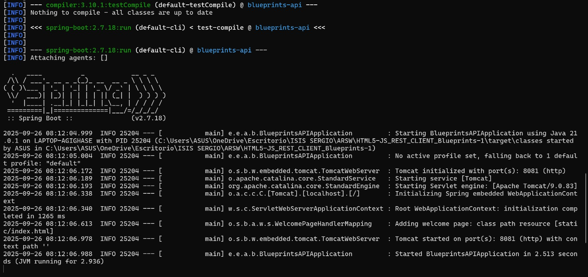
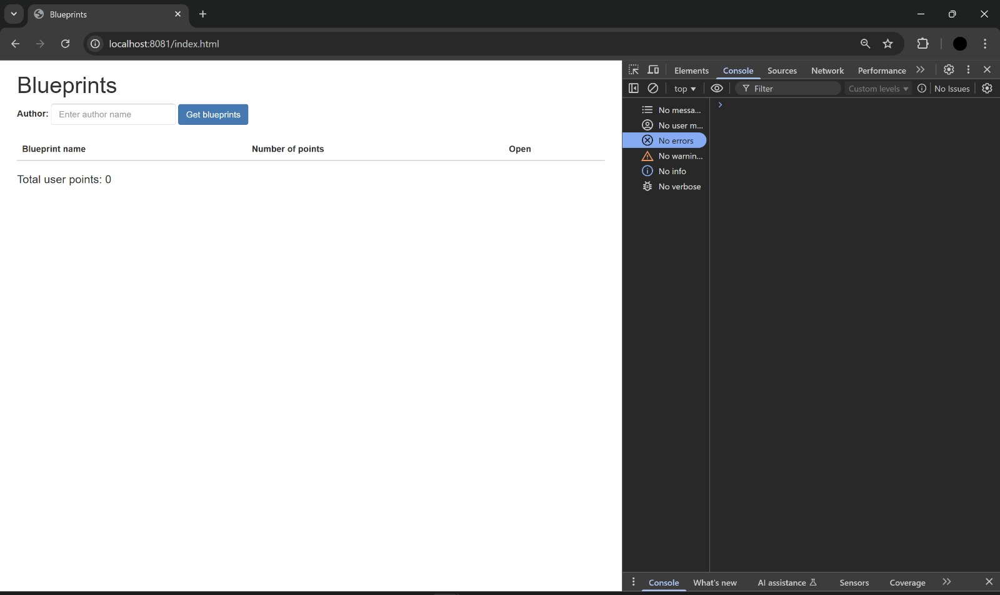
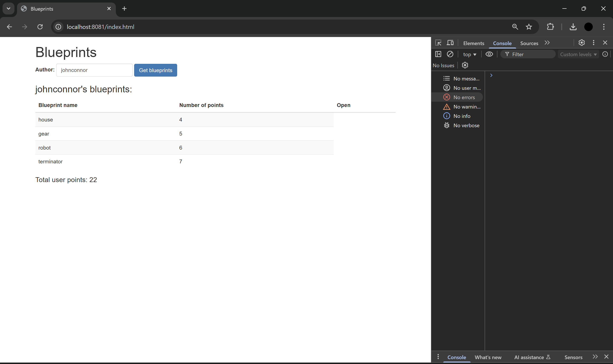
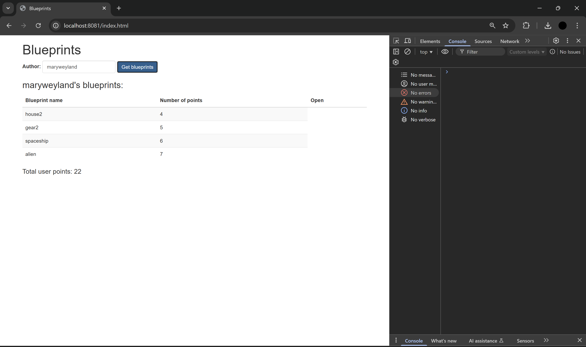
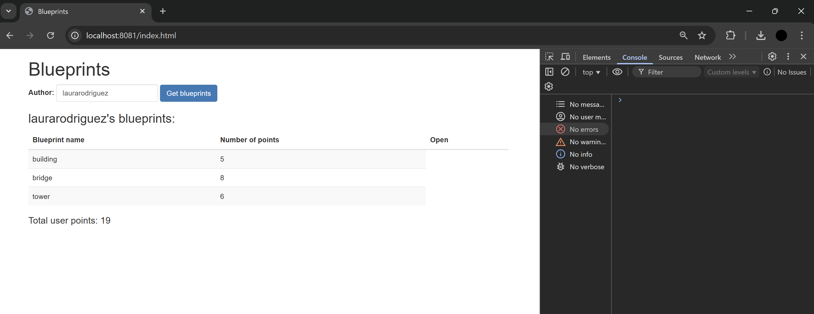
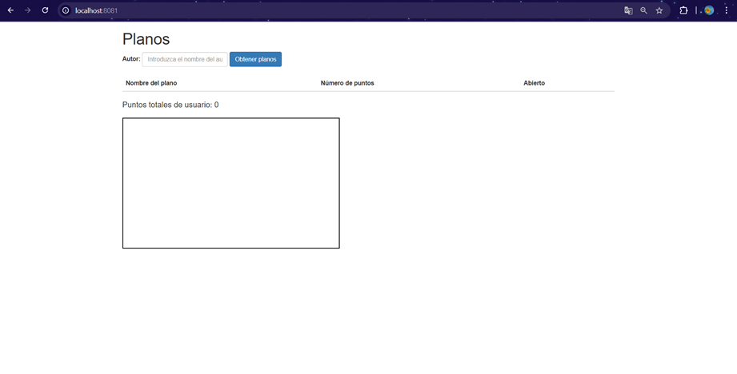
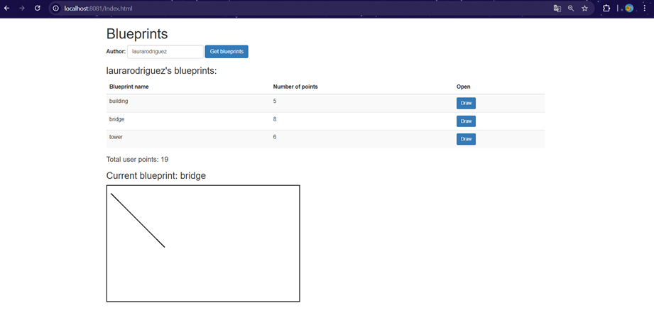
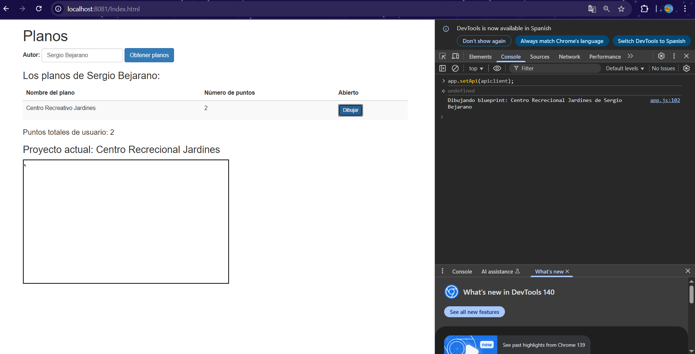
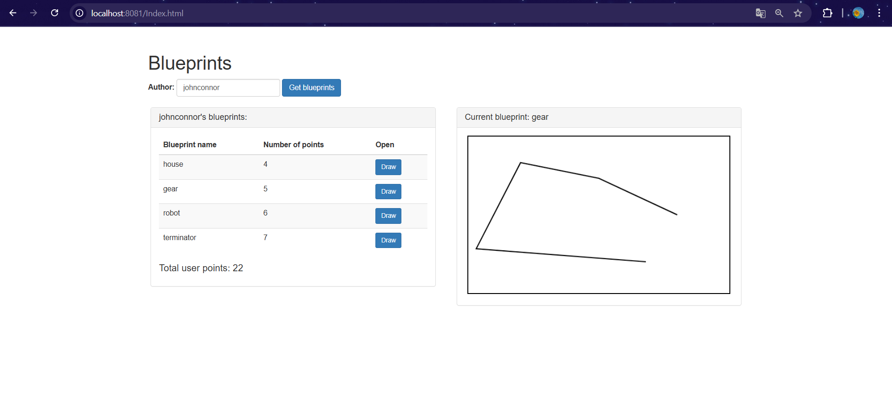

### Escuela Colombiana de Ingeniería

### Arquiecturas de Software

---
### Integrantes

- Sergio Andrés Bejarano Rodríguez
- Laura Daniela Rodríguez Sánchez

---

### Construción de un cliente 'grueso' con un API REST, HTML5, Javascript y CSS3. Parte I.


- Al oprimir 'Get blueprints', consulta los planos del usuario dado en el formulario. Por ahora, si la consulta genera un error, sencillamente no se mostrará nada.
- Al hacer una consulta exitosa, se debe mostrar un mensaje que incluya el nombre del autor, y una tabla con: el nombre de cada plano de autor, el número de puntos del mismo, y un botón para abrirlo. Al final, se debe mostrar el total de puntos de todos los planos (suponga, por ejemplo, que la aplicación tienen un modelo de pago que requiere dicha información).
- Al seleccionar uno de los planos, se debe mostrar el dibujo del mismo. Por ahora, el dibujo será simplemente una secuencia de segmentos de recta realizada en el mismo orden en el que vengan los puntos.

---

## Ajustes Backend

*1. Trabaje sobre la base del proyecto anterior (en el que se hizo el API REST).*

Para esto trasladamos la carpeta `src` y los `archivos maven` del laboratorio anterior.

*2. Incluya dentro de las dependencias de Maven los 'webjars' de jQuery y Bootstrap (esto permite tener localmente dichas librerías de JavaScript al momento de construír el proyecto):*

   ```xml
   <dependency>
       <groupId>org.webjars</groupId>
       <artifactId>webjars-locator</artifactId>
   </dependency>

   <dependency>
       <groupId>org.webjars</groupId>
       <artifactId>bootstrap</artifactId>
       <version>3.3.7</version>
   </dependency>

   <dependency>
       <groupId>org.webjars</groupId>
       <artifactId>jquery</artifactId>
       <version>3.1.0</version>
   </dependency>

   ```

Agregamos las dependencias a nuestro `pom.xml`. Se ve de la siguiente forma:

```xml
<?xml version="1.0" encoding="UTF-8"?>
<project xmlns="http://maven.apache.org/POM/4.0.0" xmlns:xsi="http://www.w3.org/2001/XMLSchema-instance"
xsi:schemaLocation="http://maven.apache.org/POM/4.0.0 http://maven.apache.org/xsd/maven-4.0.0.xsd">
<modelVersion>4.0.0</modelVersion>

	<groupId>edu.eci.pdsw.examples</groupId>
	<artifactId>blueprints-api</artifactId>
	<version>0.0.1-SNAPSHOT</version>
	<packaging>jar</packaging>

	<name>Blueprints_API</name>
	<description>Demo project for Spring Boot</description>

	<parent>
		<groupId>org.springframework.boot</groupId>
		<artifactId>spring-boot-starter-parent</artifactId>
		<version>2.7.18</version>
		<relativePath/> <!-- lookup parent from repository -->
	</parent>

	<properties>
		<project.build.sourceEncoding>UTF-8</project.build.sourceEncoding>
		<project.reporting.outputEncoding>UTF-8</project.reporting.outputEncoding>
		<java.version>17</java.version>
	</properties>

	<dependencies>
		<dependency>
			<groupId>org.springframework.boot</groupId>
			<artifactId>spring-boot-starter-web</artifactId>
		</dependency>
		<dependency>
			<groupId>org.springframework.boot</groupId>
			<artifactId>spring-boot-starter-aop</artifactId>
		</dependency>

		<dependency>
			<groupId>org.springframework.boot</groupId>
			<artifactId>spring-boot-starter-test</artifactId>
			<scope>test</scope>
		</dependency>
		
		<dependency>
			<groupId>org.webjars</groupId>
			<artifactId>webjars-locator</artifactId>
			<version>0.52</version>
		</dependency>

		<dependency>
			<groupId>org.webjars</groupId>
			<artifactId>bootstrap</artifactId>
			<version>3.3.7</version>
		</dependency>

		<dependency>
			<groupId>org.webjars</groupId>
			<artifactId>jquery</artifactId>
			<version>3.1.0</version>
		</dependency>
	</dependencies>

	<build>
		<plugins>
			<plugin>
				<groupId>org.springframework.boot</groupId>
				<artifactId>spring-boot-maven-plugin</artifactId>
				<configuration>
					<mainClass>edu.eci.arsw.blueprintsapi.BlueprintsAPIApplication</mainClass>
				</configuration>
			</plugin>
		</plugins>
	</build>
</project>

```

---

## Front-End - Vistas

*1. Cree el directorio donde residirá la aplicación JavaScript. Como se está usando SpringBoot, la ruta para poner en el mismo contenido estático (páginas Web estáticas, aplicaciones HTML5/JS, etc) es:*

   ```
   src/main/resources/static
   ```

Se crea el directorio en la ruta especificada.

```
─src
│   ├───main
│   │   ├───java
│   │   └───resources
│   │       └───static
```

*2. Cree, en el directorio anterior, la página index.html, sólo con lo básico: título, 
campo para la captura del autor, botón de 'Get blueprints', campo <div> donde se mostrará el 
nombre del autor seleccionado, [la tabla HTML](https://www.w3schools.com/html/html_tables.asp) donde se mostrará el listado de planos 
(con sólo los encabezados), y un campo <div> donde se mostrará el total de puntos de los 
planos del autor. Recuerde asociarle identificadores a dichos componentes para facilitar su 
búsqueda mediante selectores.*

```html
<!DOCTYPE html>
<html lang="en">
  <head>
    <title>Blueprints</title>
    <meta charset="UTF-8" />
    <meta name="viewport" content="width=device-width, initial-scale=1.0" />
    <!-- jQuery y Bootstrap -->
    <script src="/webjars/jquery/3.1.0/jquery.min.js"></script>
    <script src="/webjars/bootstrap/3.3.7/js/bootstrap.min.js"></script>
    <link
      rel="stylesheet"
      href="/webjars/bootstrap/3.3.7/css/bootstrap.min.css"
    />
    <script src="js/apimock.js"></script>
    <script src="js/app.js"></script>
  </head>
  <body class="container">
    <h1 class="mt-4">Blueprints</h1>
    <!-- Campo autor y botón -->
    <div class="form-inline mb-3">
      <label for="authorInput">Author: </label>
      <input
        type="text"
        id="authorInput"
        class="form-control mx-2"
        placeholder="Enter author name"
      />
      <button id="getBlueprintsBtn" class="btn btn-primary">
        Get blueprints
      </button>
    </div>
    <!-- Nombre del autor seleccionado -->
    <h3 id="authorName"></h3>
    <!-- Tabla de planos -->
    <table id="blueprintsTable" class="table table-striped">
      <thead>
        <tr>
          <th>Blueprint name</th>
          <th>Number of points</th>
          <th>Open</th>
        </tr>
      </thead>
      <tbody>
        <!-- Aquí se llenarán los planos dinámicamente -->
      </tbody>
    </table>
    <!-- Total de puntos -->
    <h4>Total user points: <span id="totalPoints">0</span></h4>
  </body>
</html>
```

*3. En el elemento \<head\> de la página, agregue las referencia a las librerías de jQuery, Bootstrap y a la hoja de estilos de Bootstrap.*

   ```html
   <head>
     <title>Blueprints</title>
     <meta charset="UTF-8" />
     <meta name="viewport" content="width=device-width, initial-scale=1.0" />

     <script src="/webjars/jquery/jquery.min.js"></script>
     <script src="/webjars/bootstrap/3.3.7/js/bootstrap.min.js"></script>
     <link
       rel="stylesheet"
       href="/webjars/bootstrap/3.3.7/css/bootstrap.min.css"
     />
   </head>
   ```

*4. Suba la aplicación (mvn spring-boot:run), y rectifique:*
   1. Que la página sea accesible desde:
   ```
   http://localhost:8080/index.html
   ```
   2. Al abrir la consola de desarrollador del navegador, NO deben aparecer mensajes de error 404 (es decir, que las librerías de JavaScript se cargaron correctamente).





---

## Front-End - Lógica

*1. Ahora, va a crear un Módulo JavaScript que, a manera de controlador, mantenga los estados y ofrezca las operaciones requeridas por la vista. Para esto tenga en cuenta el [patrón Módulo de JavaScript](https://toddmotto.com/mastering-the-module-pattern/), y cree un módulo en la ruta static/js/app.js .*

### Módulo JavaScript Controlador

Se creó un módulo JavaScript siguiendo el [patrón Módulo de JavaScript](https://toddmotto.com/mastering-the-module-pattern/) en la ruta `static/js/app.js`:

```javascript
var app = (function() {
    var selectedAuthor = "";
    var blueprintsList = [];

    return {
        // API pública del módulo
        setAuthor: function(authorName) { ... },
        updateBlueprintsList: function(authorName) { ... },
        getCurrentAuthor: function() { ... },
        getCurrentBlueprints: function() { ... },
        openBlueprint: function(blueprintName) { ... },
        init: function() { ... }
    };
})();
```

*2. Copie el módulo provisto (apimock.js) en la misma ruta del módulo antes creado. En éste agréguele más planos (con más puntos) a los autores 'quemados' en el código.*

### Módulo API Mock Ampliado

Se copió y amplió el módulo `apimock.js` en `static/js/apimock.js` con más planos y puntos:

```javascript
mockdata["johnconnor"] = [
  {
    author: "johnconnor",
    points: [
      { x: 150, y: 120 },
      { x: 215, y: 115 },
      { x: 300, y: 200 },
      { x: 180, y: 350 },
    ],
    name: "house",
  },
  {
    author: "johnconnor",
    points: [
      { x: 340, y: 240 },
      { x: 15, y: 215 },
      { x: 100, y: 50 },
      { x: 250, y: 80 },
      { x: 400, y: 150 },
    ],
    name: "gear",
  },
  {
    author: "johnconnor",
    points: [
      { x: 50, y: 50 },
      { x: 100, y: 100 },
      { x: 150, y: 150 },
      { x: 200, y: 200 },
      { x: 250, y: 250 },
      { x: 300, y: 300 },
    ],
    name: "robot",
  },
  {
    author: "johnconnor",
    points: [
      { x: 10, y: 10 },
      { x: 20, y: 30 },
      { x: 40, y: 60 },
      { x: 80, y: 120 },
      { x: 160, y: 240 },
      { x: 320, y: 480 },
      { x: 640, y: 960 },
    ],
    name: "terminator",
  },
];

mockdata["maryweyland"] = [
  // 4 planos con más puntos... (ver más detalles del código en static/js/apimock.js)
];

mockdata["laurarodriguez"] = [
  // Nueva autora agregada con 3 planos...
];
```

*3. Agregue la importación de los dos nuevos módulos a la página HTML (después de las importaciones de las librerías de jQuery y Bootstrap):*

### Importación de Módulos

Se agregaron las importaciones a `index.html` después de jQuery y Bootstrap:

```html
<script src="/webjars/jquery/3.1.0/jquery.min.js"></script>
<script src="/webjars/bootstrap/3.3.7/js/bootstrap.min.js"></script>
<link rel="stylesheet" href="/webjars/bootstrap/3.3.7/css/bootstrap.min.css" />
<script src="js/apimock.js"></script>
<script src="js/app.js"></script>
```

*4. Haga que el módulo antes creado mantenga de forma privada:*

   - El nombre del autor seleccionado.
   - El listado de nombre y tamaño de los planos del autor seleccionado. Es decir, una lista objetos, donde cada objeto tendrá dos propiedades: nombre de plano, y número de puntos del plano.

   Junto con una operación pública que permita cambiar el nombre del autor actualmente seleccionado.


### Estado Privado y Operación Pública

El módulo mantiene de forma privada:

**Variables Privadas:**

```javascript
var selectedAuthor = "";
var blueprintsList = [];
```

**Operación Pública para cambiar autor:**

```javascript
setAuthor: function(authorName) {
    if (authorName && authorName.trim() !== "") {
        selectedAuthor = authorName.trim();
    } else {
        selectedAuthor = "";
        blueprintsList = [];
    }
}
```

*5. Agregue al módulo 'app.js' una operación pública que permita actualizar el listado de los planos, a partir del nombre de su autor (dado como parámetro). Para hacer esto, dicha operación debe invocar la operación 'getBlueprintsByAuthor' del módulo 'apimock' provisto, enviándole como _callback_ una función que:*

   - Tome el listado de los planos, y le aplique una función 'map' que convierta sus elementos a objetos con sólo el nombre y el número de puntos.

   - Sobre el listado resultante, haga otro 'map', que tome cada uno de estos elementos, y a través de jQuery agregue un elemento \<tr\> (con los respectvos \<td\>) a la tabla creada en el punto 4. Tenga en cuenta los [selectores de jQuery](https://www.w3schools.com/JQuery/jquery_ref_selectors.asp) y [los tutoriales disponibles en línea](https://www.tutorialrepublic.com/codelab.php?topic=faq&file=jquery-append-and-remove-table-row-dynamically). Por ahora no agregue botones a las filas generadas.

   - Sobre cualquiera de los dos listados (el original, o el transformado mediante 'map'), aplique un 'reduce' que calcule el número de puntos. Con este valor, use jQuery para actualizar el campo correspondiente dentro del DOM.

### Operación de Actualización con Map y Reduce

Se implementó `updateBlueprintsList()` que:

**Invoca getBlueprintsByAuthor:**

```javascript
apimock.getBlueprintsByAuthor(authorName, function (blueprints) {
  // Callback implementado según especificaciones (ver código en /resources/static/js/app.js)
});
```

**Primer Map - Conversión de datos:**

```javascript
// Convertir elementos a objetos con solo nombre y número de puntos
blueprintsList = blueprints.map(function (blueprint) {
  return {
    name: blueprint.name,
    numberOfPoints: blueprint.points.length,
  };
});
```

**Segundo Map - Generación de filas HTML:**

```javascript
// Agregar elementos <tr> a la tabla usando jQuery
blueprintsList.map(function (blueprint) {
  var row = $("<tr>");
  row.append($("<td>").text(blueprint.name));
  row.append($("<td>").text(blueprint.numberOfPoints));
  $("#blueprintsTable tbody").append(row);
  return row;
});
```

**Reduce - Cálculo total de puntos:**

```javascript
// Calcular el número total de puntos
var totalPoints = blueprintsList.reduce(function (total, blueprint) {
  return total + blueprint.numberOfPoints;
}, 0);

// Actualizar el DOM usando jQuery
$("#totalPoints").text(totalPoints);
```

*6. Asocie la operación antes creada (la de app.js) al evento 'on-click' del botón de consulta de la página.*

### Asociación al Evento Click

La operación se asoció al botón de consulta:

```javascript
init: function() {
    // Asociar updateBlueprintsList al evento click del botón
    $("#getBlueprintsBtn").click(function() {
        var authorName = $("#authorInput").val();
        if (authorName && authorName.trim() !== "") {
            app.updateBlueprintsList(authorName.trim());
        }
    });

    // También permitir búsqueda con Enter
    $("#authorInput").keypress(function(e) {
        if (e.which === 13) { // Enter key
            var authorName = $("#authorInput").val();
            if (authorName && authorName.trim() !== "") {
                app.updateBlueprintsList(authorName.trim());
            }
        }
    });
}
```

*7. Verifique el funcionamiento de la aplicación. Inicie el servidor, abra la aplicación HTML5/JavaScript, y rectifique que al ingresar un usuario existente, se cargue el listado del mismo.*

### Verificación de Funcionamiento

**Autores disponibles para prueba:**

- `johnconnor` (4 planos: house, gear, robot, terminator)



- `maryweyland` (4 planos: house2, gear2, spaceship, alien)



- `laurarodriguez` (3 planos: building, bridge, tower)



Para verificar: Iniciar el servidor (`mvn spring-boot:run`), abrir `http://localhost:8081/index.html`, ingresar un nombre de autor y hacer clic en "Get blueprints".

---

## Para la próxima semana

*8. A la página, agregue un [elemento de tipo Canvas](https://www.w3schools.com/html/html5_canvas.asp), con su respectivo identificador. Haga que sus dimensiones no sean demasiado grandes para dejar espacio para los otros componentes, pero lo suficiente para poder 'dibujar' los planos.*

Se agrega al archivo `index.html`

````html
<!-- Canvas -->
<div id="blueprint-canvas-container">
    <h3 id="blueprint-title"></h3>
    <canvas id="myCanvas" width="500" height="300" style="border:2px solid #000000;"> </canvas>
</div>
````

Obtenemos el siguiente resultado:



*9. Al módulo app.js agregue una operación que, dado el nombre de un autor, y el nombre de uno de sus planos dados como parámetros, haciendo uso del método getBlueprintsByNameAndAuthor de apimock.js y de una función _callback_:*

   - Consulte los puntos del plano correspondiente, y con los mismos dibuje consectivamente segmentos de recta, haciendo uso [de los elementos HTML5 (Canvas, 2DContext, etc) disponibles](https://www.w3schools.com/html/tryit.asp?filename=tryhtml5_canvas_tut_path)\* Actualice con jQuery el campo <div> donde se muestra el nombre del plano que se está dibujando (si dicho campo no existe, agruéguelo al DOM).

En `app.js` agregamos:

````javascript
drawBlueprint: function (author, bpname) {
    console.log(`Dibujando blueprint: ${bpname} de ${author}`);

    apimock.getBlueprintsByNameAndAuthor(author, bpname, function (blueprint) {
        if (!blueprint || !Array.isArray(blueprint.points) || blueprint.points.length === 0) {
            console.log("No se encontraron puntos en el blueprint.");
            $("#blueprint-title").text("No points to draw for: " + bpname);
            return;
        }

        $("#blueprint-title").text(`Current blueprint: ${bpname}`);

        var canvas = document.getElementById("myCanvas");
        if (!canvas) {
            console.error("Canvas 'myCanvas' no encontrado en el DOM.");
            return;
        }

        var ctx = canvas.getContext("2d");
// Limpiar canvas
        ctx.clearRect(0, 0, canvas.width, canvas.height);

        var points = blueprint.points;

// Dibujo de la línea que conecta los puntos en orden
        ctx.beginPath();
        ctx.lineWidth = 2;
        ctx.strokeStyle = "#000"; // negro por defecto
        ctx.moveTo(points[0].x, points[0].y);

        for (var i = 1; i < points.length; i++) {
            ctx.lineTo(points[i].x, points[i].y);
        }
        ctx.stroke();
    });
},
````

*10. Verifique que la aplicación ahora, además de mostrar el listado de los planos de un autor, permita seleccionar uno de éstos y graficarlo. Para esto, haga que en las filas generadas para el punto 5 incluyan en la última columna un botón con su evento de clic asociado a la operación hecha anteriormente (enviándo como parámetro los nombres correspondientes).*

Para implementar esto, en `app.js` modificamos en la función `updateBlueprintsList`

````javascript
 blueprintsList.map(function(blueprint) {
    var row = $("<tr>");
    row.append($("<td>").text(blueprint.name));
    row.append($("<td>").text(blueprint.numberOfPoints));
    var button = $("<button>")
        .addClass("btn btn-sm btn-primary btn-draw")
        .attr("data-bpname", blueprint.name)
        .text("Draw");
    row.append($("<td>").append(button));

    $("#blueprintsTable tbody").append(row);
    return row;
});
````

Dónde específicamente agregamos el botón con

````javascript
    var button = $("<button>")
        .addClass("btn btn-sm btn-primary btn-draw")
        .attr("data-bpname", blueprint.name)
        .text("Draw");
    row.append($("<td>").append(button));
````

Además, en esa misma función agregamos:

````javascript
    $(".btn-draw").off("click").on("click", function () {
    var bpname = $(this).data("bpname");
    app.drawBlueprint(selectedAuthor, bpname);
    });
````

*11. Verifique que la aplicación ahora permita: consultar los planos de un auto y graficar aquel que se seleccione.*

Realizamos la prueba y obtenemos lo siguiente:



*12. Una vez funcione la aplicación (sólo front-end), haga un módulo (llámelo 'apiclient') que tenga las mismas operaciones del 'apimock', pero que para las mismas use datos reales consultados del API REST. Para lo anterior revise [cómo hacer peticiones GET con jQuery](https://api.jquery.com/jquery.get/), y cómo se maneja el esquema de _callbacks_ en este contexto.*

Creamos el módulo `apiclient.js`:

````javascript
var apiclient = (function () {
    var apiUrl = "http://localhost:8080/blueprints";

    return {
        getBlueprintsByAuthor: function (authname, callback) {
            $.get(apiUrl + "/" + authname)
                .done(function (data) {
                    callback(data);
                })
                .fail(function (error) {
                    console.error("Error obteniendo planos del autor:", error);
                });
        },

        getBlueprintsByNameAndAuthor: function (authname, bpname, callback) {
            $.get(apiUrl + "/" + authname + "/" + bpname)
                .done(function (data) {
                    callback(data);
                })
                .fail(function (error) {
                    console.error("Error obteniendo el plano:", error);
                });
        }
    };
})();
````

*13. Modifique el código de app.js de manera que sea posible cambiar entre el 'apimock' y el 'apiclient' con sólo una línea de código.*

Para esto realizamos:

**1.** Agregamos la variable api, donde por defecto usará apimock por defecto.

````javascript
    var api = apimock;
````

**2.** Dentro del *return* cambiamos todos los `apimock` por `api`, nuestra variable creada en el paso anterior. Por ejemplo:

````javascript
    apimock.getBlueprintsByAuthor(authorName, function(blueprints)
````
Pasa a
````javascript
    api.getBlueprintsByAuthor(authorName, function(blueprints)
````

**3.** Agregamos el siguiente set para poder cambiar entre apimock y apiclient ejecutando en la consola del navegador el comando `app.setApi(apiclient);`.
````javascript
    setApi: function (newApi) {
       api = newApi;
    }
````

**4.** Por último, en `index.html` agregamos la siguiente línea:
````html
    <script src="js/apiclient.js"></script>
````

Comprobamos su correcto funcionamiento:



*14. Revise la [documentación y ejemplos de los estilos de Bootstrap](https://v4-alpha.getbootstrap.com/examples/) (ya incluidos en el ejercicio), agregue los elementos necesarios a la página para que sea más vistosa, y más cercana al mock dado al inicio del enunciado.*

Finalmente, modificamos nuestro `index.html` (ahora con estilos):

````html
<!DOCTYPE html>
<html lang="en">
<head>
    <title>Blueprints</title>
    <meta charset="UTF-8">
    <meta name="viewport" content="width=device-width, initial-scale=1.0">

    <!-- jQuery y Bootstrap -->
    <script src="/webjars/jquery/3.1.0/jquery.min.js"></script>
    <script src="/webjars/bootstrap/3.3.7/js/bootstrap.min.js"></script>
    <link rel="stylesheet" href="/webjars/bootstrap/3.3.7/css/bootstrap.min.css"/>
    <script src="js/apimock.js"></script>
    <script src="js/apiclient.js"></script>
    <script src="js/app.js"></script>

    <style>
        body {
            margin-top: 30px;
        }
        .form-inline {
            margin-bottom: 20px;
        }
        .panel {
            margin-bottom: 25px;
        }
        .col-md-6 {
            padding-left: 20px;
            padding-right: 20px;
        }
    </style>
</head>
<body class="container">
<h1 class="mb-4">Blueprints</h1>

<!-- Campo autor y botón -->
<div class="form-inline mb-4">
    <label for="authorInput" class="mr-2"><strong>Author:</strong></label>
    <input type="text" id="authorInput" class="form-control mx-2" placeholder="Enter author name"/>
    <button id="getBlueprintsBtn" class="btn btn-primary">Get blueprints</button>
</div>

<div class="row">
    <!-- Panel de Blueprints -->
    <div class="col-md-6">
        <div class="panel panel-default">
            <div class="panel-heading">
                <h3 id="authorName" class="panel-title">Author's blueprints</h3>
            </div>
            <div class="panel-body">
                <table id="blueprintsTable" class="table table-striped">
                    <thead>
                    <tr>
                        <th>Blueprint name</th>
                        <th>Number of points</th>
                        <th>Open</th>
                    </tr>
                    </thead>
                    <tbody>
                    <!-- Aquí se llenarán los planos dinámicamente -->
                    </tbody>
                </table>
                <h4 class="mt-3">Total user points: <span id="totalPoints">0</span></h4>
            </div>
        </div>
    </div>

    <!-- Panel del Canvas -->
    <div class="col-md-6">
        <div class="panel panel-default">
            <div class="panel-heading">
                <h3 id="blueprint-title" class="panel-title">Current blueprint: none</h3>
            </div>
            <div class="panel-body text-center">
                <canvas id="myCanvas" width="500" height="300" style="border:2px solid #000000;"></canvas>
            </div>
        </div>
    </div>
</div>

</body>
</html>
````

El cual se ve de la siguiente manera:


